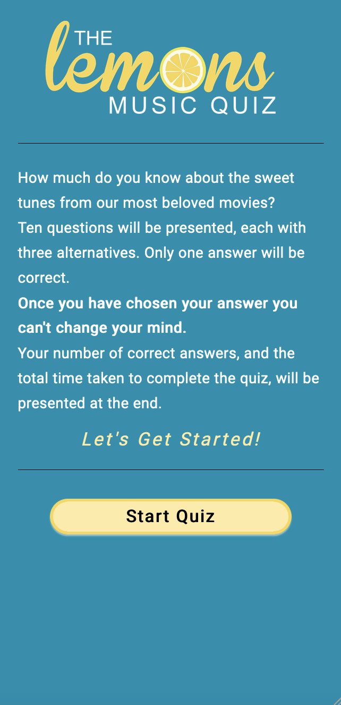
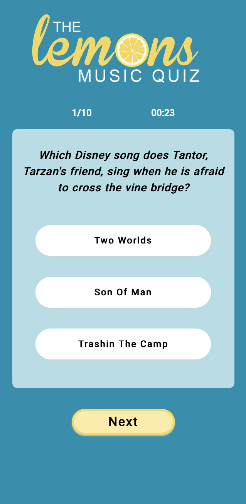
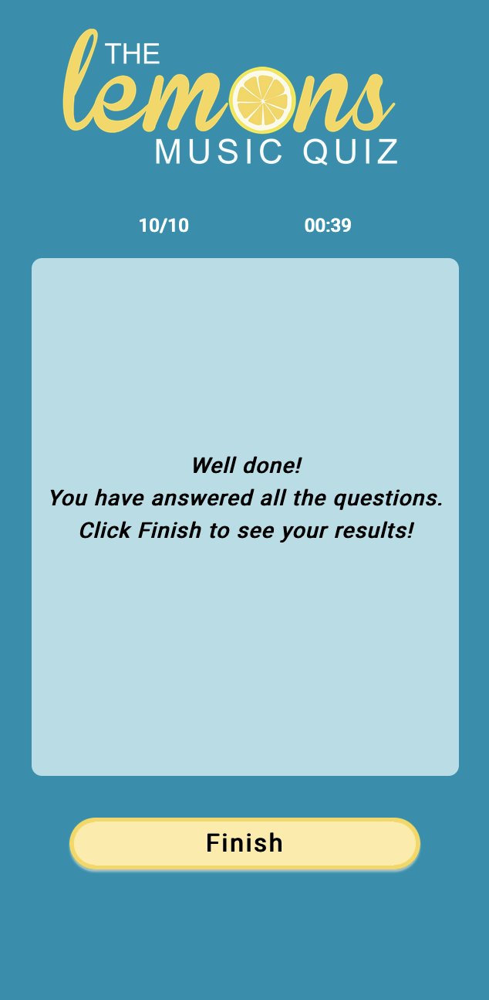
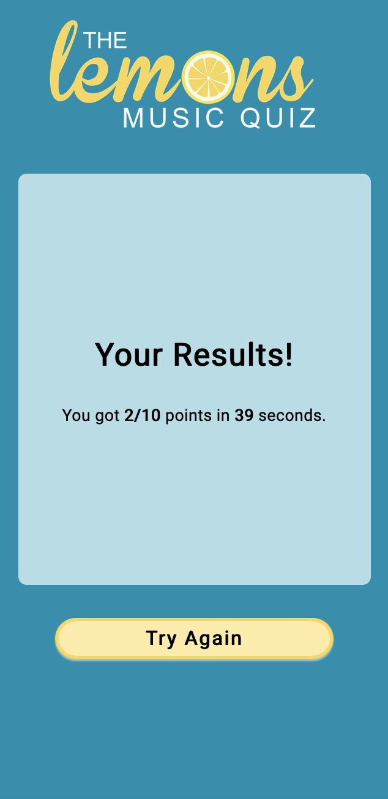

# The Lemon's Music Quiz

*This was a group assignment in the basic JavaScript course and the Agile project course at the Front End Development program at Medieinstitutet Stockholm.*

This is a prototype of a movie music quiz app.

The project contains an array of 40 movie music related quiz questions. Each question has three answer alternatives, where only one alternative is correct. 

10 questionss are randomly selected from the question-array and shown one by one in the first round of the game, toghether with the three answer alterniatives printed at one button each.

When the user chooses an alternative and clicks it they will see the button turn green if it was the correct answer, or red if it was wrong. When the user clicks the Next-button the next question will be shown. 

When the user has answered all 10 questions a result-page will be shown letting the user know how many correct answer they got and how long time it took. 

If the user choses to play again another 10 random numbers will be shown in the second game round, making sure it will not be the same questions as in the first round. 

## Authors

- [@fannyestrom](https://github.com/fannyestrom)
- [@SaraGdbg](https://github.com/SaraGdbg)
- [@JohannaPri](https://github.com/JohannaPri)
- [@ReginaJM](https://github.com/ReginaJM)

## Demo

https://medieinstitutet.github.io/fed23d-javascript-grundkurs-gruppuppgift-citronerna/

## Built with

- HTML
- CSS
- Sass
- JavaScript
- TypeScript
- Node.js
- Vite

## Team work methodology

- Agile WoW

## Screenshots

- Start page

- Game page

- Finish page

- Results page

